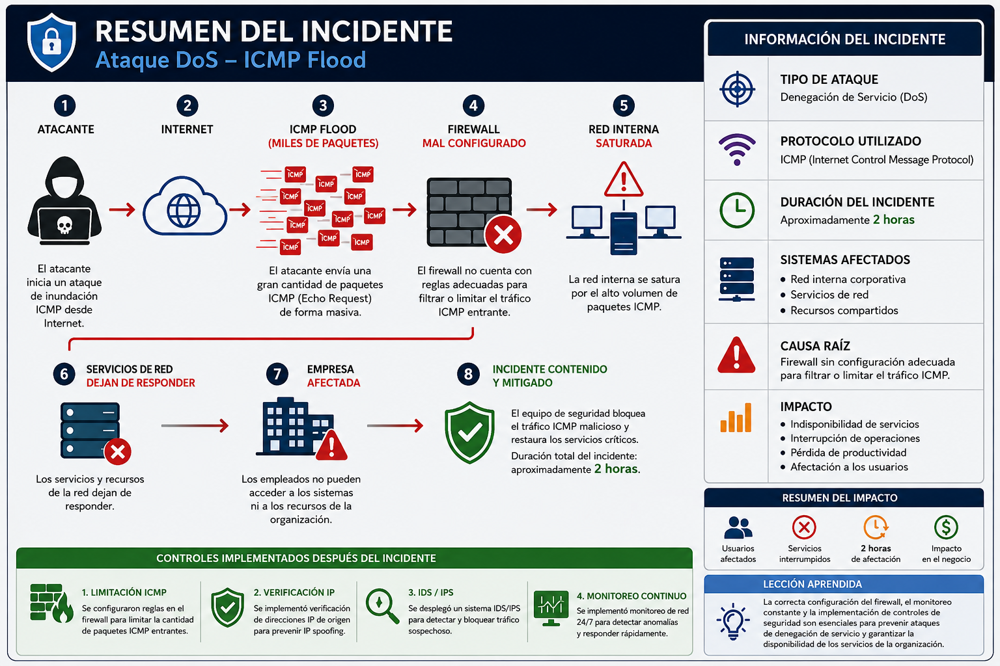
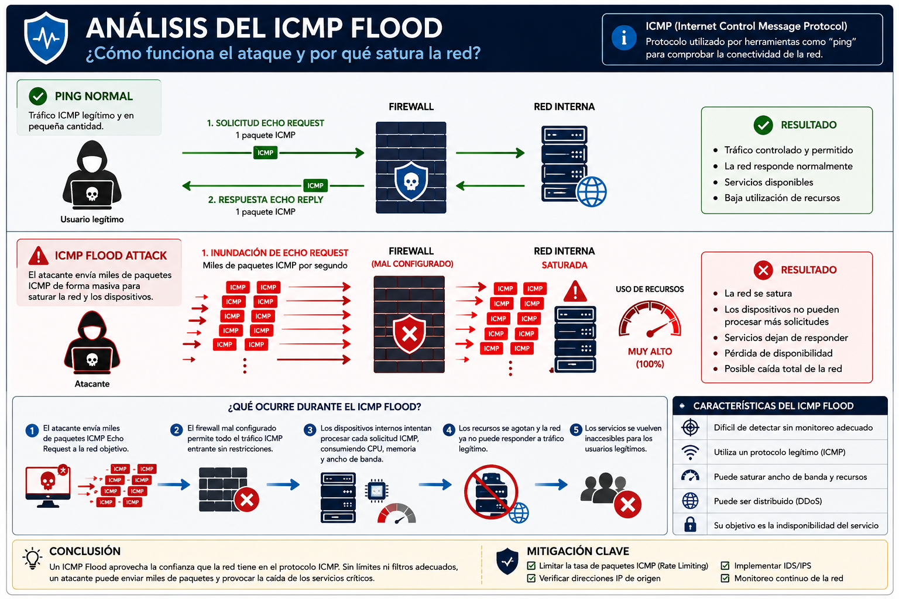
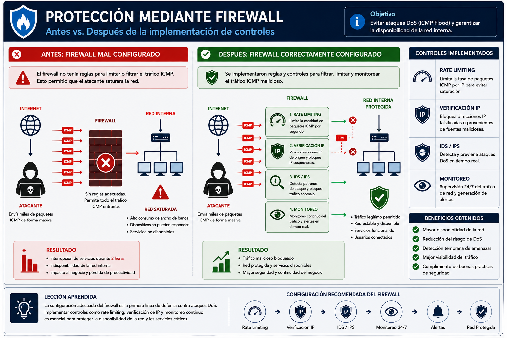
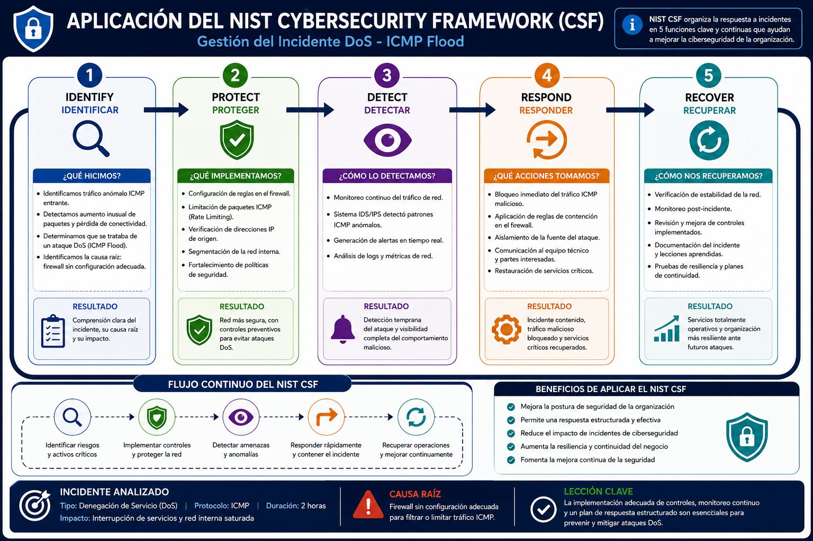

# Cybersecurity Incident Response using the NIST Cybersecurity Framework (CSF)

## Descripción del proyecto

Este proyecto documenta el análisis de un incidente de ciberseguridad utilizando el **NIST Cybersecurity Framework (CSF)**. El escenario describe un ataque de Denegación de Servicio (DoS) basado en una inundación de paquetes ICMP que afectó la disponibilidad de la red corporativa durante dos horas.

El objetivo es analizar el incidente, identificar la causa raíz, evaluar el impacto sobre la organización y proponer controles de seguridad utilizando las cinco funciones del NIST CSF.

---

## Objetivos

- Analizar un incidente de Denegación de Servicio (DoS).
- Identificar vulnerabilidades en la infraestructura de red.
- Aplicar el marco NIST Cybersecurity Framework (CSF).
- Diseñar un plan de protección, detección, respuesta y recuperación.
- Documentar el incidente siguiendo buenas prácticas de ciberseguridad.

---

## Conceptos aplicados

- NIST Cybersecurity Framework (CSF)
- Denial of Service (DoS)
- ICMP Flood
- Firewall Security
- Rate Limiting
- IP Source Verification
- IDS / IPS
- Network Monitoring
- Incident Response
- Network Availability

---

## Hallazgos principales

- Se identificó un ataque DoS mediante tráfico ICMP.
- La causa raíz fue una configuración inadecuada del firewall.
- La red interna permaneció indisponible durante aproximadamente dos horas.
- Se implementaron nuevas reglas de firewall para limitar paquetes ICMP.
- Se añadió validación de direcciones IP de origen.
- Se implementó un sistema IDS/IPS y monitoreo continuo de la red.

---

## Aplicación del NIST Cybersecurity Framework

### Identify

- Identificar el ataque DoS.
- Identificar la vulnerabilidad del firewall.
- Evaluar el impacto sobre la red.

### Protect

- Configurar reglas de firewall.
- Limitar el tráfico ICMP.
- Verificar las direcciones IP de origen.

### Detect

- Supervisar continuamente la red.
- Utilizar un sistema IDS/IPS.
- Detectar tráfico anómalo.

### Respond

- Bloquear el tráfico ICMP malicioso.
- Contener el incidente.
- Restaurar los servicios críticos.

### Recover

- Recuperar los servicios afectados.
- Verificar la estabilidad de la red.
- Implementar mejoras para prevenir futuros incidentes.

---

## Estructura del proyecto

```text
cybersecurity-incident-response-nist-csf/
│
├── README.md
├── incident-analysis.md
├── nist-csf-report.md
│
└── assets/
```

### Archivos

- **incident-analysis.md** → Análisis técnico del incidente.
- **nist-csf-report.md** → Aplicación del NIST Cybersecurity Framework.
- **assets/** → Diagramas, dashboards y evidencias visuales.

---

## Conclusión

Este proyecto demuestra cómo utilizar el NIST Cybersecurity Framework (CSF) para gestionar un incidente de ciberseguridad desde su identificación hasta la recuperación. La correcta configuración del firewall, el monitoreo continuo y la implementación de controles preventivos fortalecen la resiliencia de la organización frente a futuros ataques de Denegación de Servicio.


## Evidencias Visuales

### 1. Resumen del Incidente



### 2. ICMP Flood



### 3. Protección mediante Firewall



### 4. Aplicación del NIST CSF


### 5. Dashboard Ejecutivo


